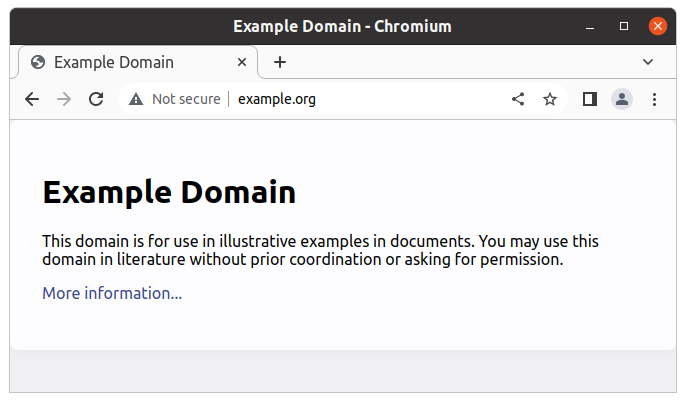
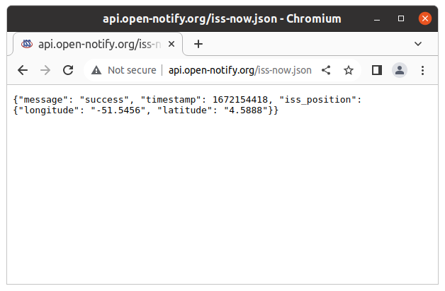
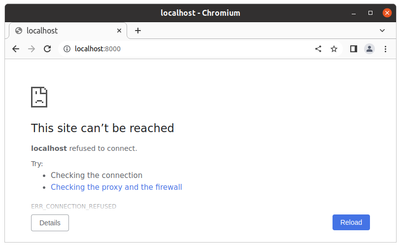
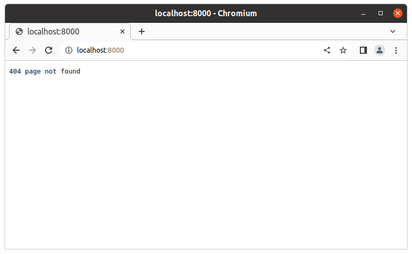
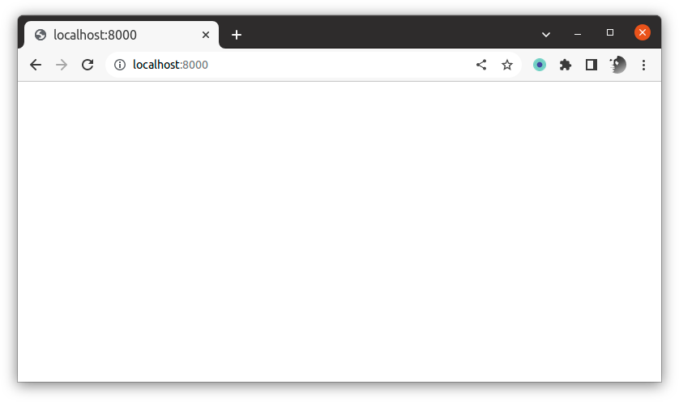
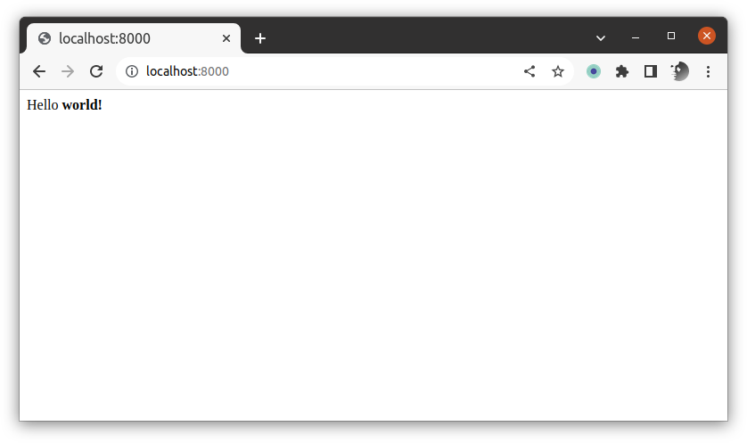
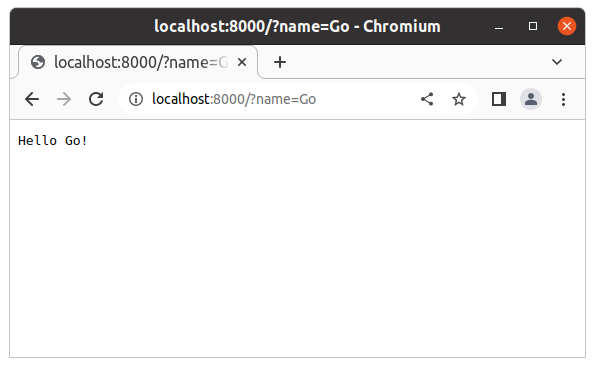

Go and Distributed Systems
================================================================================

HTTP Client
--------------------------------------------------------------------------------

### HTML Content



```bash
$ curl http://example.org
<!doctype html>
<html>
<head>
    <title>Example Domain</title>

    <meta charset="utf-8" />
    <meta http-equiv="Content-type" content="text/html; charset=utf-8" />
    <meta name="viewport" content="width=device-width, initial-scale=1" />
    <style type="text/css">
    body {
        background-color: #f0f0f2;
        margin: 0;
        padding: 0;
        font-family: -apple-system, system-ui, BlinkMacSystemFont, "Segoe UI", "Open Sans", "Helvetica Neue", Helvetica, Arial, sans-serif;
        
    }
    div {
        width: 600px;
        margin: 5em auto;
        padding: 2em;
        background-color: #fdfdff;
        border-radius: 0.5em;
        box-shadow: 2px 3px 7px 2px rgba(0,0,0,0.02);
    }
    a:link, a:visited {
        color: #38488f;
        text-decoration: none;
    }
    @media (max-width: 700px) {
        div {
            margin: 0 auto;
            width: auto;
        }
    }
    </style>    
</head>

<body>
<div>
    <h1>Example Domain</h1>
    <p>This domain is for use in illustrative examples in documents. You may use this
    domain in literature without prior coordination or asking for permission.</p>
    <p><a href="https://www.iana.org/domains/example">More information...</a></p>
</div>
</body>
</html>
```

`app.go`:

```go
package main

import (
	"fmt"
	"io"
	"net/http"
)

func main() {
	resp, _ := http.Get("http://example.org")
	bytes, _ := io.ReadAll(resp.Body)
	fmt.Println(string(bytes))
}
```

```bash
$ go run app.go 
<!doctype html>
<html>
<head>
    <title>Example Domain</title>

    <meta charset="utf-8" />
    <meta http-equiv="Content-type" content="text/html; charset=utf-8" />
    <meta name="viewport" content="width=device-width, initial-scale=1" />
    <style type="text/css">
    body {
        background-color: #f0f0f2;
        margin: 0;
        padding: 0;
        font-family: -apple-system, system-ui, BlinkMacSystemFont, "Segoe UI", "Open Sans", "Helvetica Neue", Helvetica, Arial, sans-serif;
        
    }
    div {
        width: 600px;
        margin: 5em auto;
        padding: 2em;
        background-color: #fdfdff;
        border-radius: 0.5em;
        box-shadow: 2px 3px 7px 2px rgba(0,0,0,0.02);
    }
    a:link, a:visited {
        color: #38488f;
        text-decoration: none;
    }
    @media (max-width: 700px) {
        div {
            margin: 0 auto;
            width: auto;
        }
    }
    </style>    
</head>

<body>
<div>
    <h1>Example Domain</h1>
    <p>This domain is for use in illustrative examples in documents. You may use this
    domain in literature without prior coordination or asking for permission.</p>
    <p><a href="https://www.iana.org/domains/example">More information...</a></p>
</div>
</body>
</html>
```

### JSON API


#### Where is the ISS?




`app.go`

```go
package main

import (
    "io"
    "net/http"
)

func PrintISSPosition() {
    resp, _ := http.Get("http://api.open-notify.org/iss-now.json")
    body := resp.Body
    bytes, _ := io.ReadAll(body)
    fmt.Println(string(bytes))
}

func main() {
    PrintISSPosition()
}
```

```
$ go run app.go 
{"message": "success", "timestamp": 1672155304, 
"iss_position": {"longitude": "-13.8055", "latitude": "-37.7661"}}
```

If you want to make an HTTP Request and you have some additional workload, be aware that these requests take some time.

```go
import (
    "fmt"
    "time"
)

...

func Compute() {
    for i := 1; i <= 10; i++ {
    time.Sleep(time.Second / 10)
    fmt.Print(i, " ")
    }
    fmt.Println("")
}

func main() {
    PrintISSPosition()
    Compute()
}
```


```
$ time go run app.go 
{"message": "success", "timestamp": 1672155760, 
"iss_position": {"longitude": "21.8250", "latitude": "-50.7057"}}
1 2 3 4 5 6 7 8 9 10 

real    0m1,710s
user    0m0,394s
sys     0m0,125s
```

So making the request in the background with a coroutine is sensible.

```go

func main() {
    go PrintISSPosition()
    Compute()
}

```


```
$ time go run app.go 
1 2 3 4 {"message": "success", "timestamp": 1672156095, 
"iss_position": {"longitude": "54.5906", "latitude": "-49.9492"}}
5 6 7 8 9 10 

real    0m1,318s
user    0m0,400s
sys     0m0,163s
```

The `encoding/json` Go package can be used to extract the relevant data from the JSON string.

```go
package main

import (
	"encoding/json"
	"fmt"
	"io"
	"net/http"
)

type Position struct {
	Latitude  string `json:"latitude"`
	Longitude string `json:"longitude"`
}

type Wrapper struct {
	TimeStamp   int      `json:"timestamp"`
	ISSPosition Position `json:"iss_position"`
	Message     string   `json:"message"`
}

func GetISSPosition() Position {
	resp, _ := http.Get("http://api.open-notify.org/iss-now.json")
	body := resp.Body
	bytes, _ := io.ReadAll(body)
	wrapper := Wrapper{}
	json.Unmarshal([]byte(bytes), &wrapper)
	return wrapper.ISSPosition
}

func main() {
	pos := GetISSPosition()
	fmt.Printf("latitude: %s, longitude: %s\n", pos.Latitude, pos.Longitude)
}
```

```bash
$ go run app.go 
latitude: 23.7538, longitude: -142.2912
```

HTTP Server
--------------------------------------------------------------------------------

```
$ curl localhost:8000
curl: (7) Failed to connect to localhost port 8000: Connection refused
```

With a web browser




`app.go`

```go
package main

import (
    "net/http"
)

func main() {
    http.ListenAndServe(":8000", nil)
}
```

```bash
$ curl localhost:8000
404 page not found
```

With a web browser




`app.go`
```go
package main

import (
    "fmt"
    "net/http"
    "time"
)

func Handler(w http.ResponseWriter, r *http.Request) {
    fmt.Println(time.Now())
}

func main() {
    http.HandleFunc("/", Handler)
    http.ListenAndServe(":8000", nil)
}
```

```bash
$ go run app.go
⏳
```

```bash
$ curl localhost:8000
```

```bash
$ go run app.go
2022-12-22 12:26:33.497397732 +0100 CET m=+75.067678037
⏳
```

```bash
$ curl localhost:8000
```

```bash
$ go run app.go 
2022-12-22 12:26:33.497397732 +0100 CET m=+75.067678037
2022-12-22 12:28:16.657047211 +0100 CET m=+178.227327515
⏳
```

Via a web browser



```
$ go run app.go 
2022-12-22 12:29:17.925020503 +0100 CET m=+239.495300807
2022-12-22 12:29:18.128862112 +0100 CET m=+239.699142416
2022-12-22 12:29:18.980003382 +0100 CET m=+240.550283695
⏳
```

```go
func main() {
    http.HandleFunc("/", Handler)
    err := http.ListenAndServe(":8000", nil)
    if err != nil {
        panic(err)
    }
}
```

```go
$ go run app.go 
panic: listen tcp :8000: bind: address already in use
```

```go
func main() {
    http.HandleFunc("/", Handler)
    port := os.Getenv("PORT")
    if port == "" {
        port = "8000"
    }
    err := http.ListenAndServe(":"+port, nil)
    if err != nil {
        panic(err)
    }
}
```

```
$ PORT=8001 go run app.go
```

```
$ curl localhost:8001
```


```bash
$ PORT=8001 go run app.go
2022-12-22 12:43:15.285093389 +0100 CET m=+4.132247194
⏳
```

```go
func Handler(w http.ResponseWriter, r *http.Request) {
    w.Write([]byte("Hello world!\n"))
}
```

```bash
$ curl localhost:8000
Hello world!
```

With a web browser


```go
func Handler(w http.ResponseWriter, r *http.Request) {
    html := "<p>Hello <b>world!</b></p>\n"
    w.Write([]byte(html))
}
```

```bash
$ curl localhost:8000
<p>Hello <b>world!</b></p>
```

From browser



```go
func Handler(w http.ResponseWriter, r *http.Request) {
    IPAddr := r.RemoteAddr
    w.Write([]byte("Hello " + IPAddr + "!\n"))
}
```

```bash
$ curl localhost:8000
Hello 127.0.0.1:48358!
```

```go
func GetIPAddr(r *http.Request) string {
    IPAddrPort := r.RemoteAddr
    if IPAddrPort == "" {
        panic("IP address is undefined")
    }
    IPAddr := strings.Split(IPAddrPort, ":")[0] // 🪲: very brittle
    return IPAddr
}

func Handler(w http.ResponseWriter, r *http.Request) {
    w.Write([]byte("Hello " + GetIPAddr(r) + "!\n"))
}
```

```bash
$ curl localhost:8000
Hello 127.0.0.1!
```

```go
func Handler(w http.ResponseWriter, r *http.Request) {
    w.Header().Add("Content-Type", "plain/html")
    w.Write([]byte("Hello " + GetIPAddr(r) + "!\n"))
}

func API(w http.ResponseWriter, r *http.Request) {
    w.Header().Add("Content-Type", "application/json")
    json := fmt.Sprintf(`{"ip_address": "%s"}`, GetIPAddr(r)) + "\n"
    w.Write([]byte(json))
}

func main() {
    http.HandleFunc("/", Handler)
    http.HandleFunc("/api", API)
    port := os.Getenv("PORT")
    if port == "" {
        port = "8000"
    }
    err := http.ListenAndServe(":"+port, nil)
    if err != nil {
        panic(err)
    }
}
```

```bash
$ curl localhost:8000
Hello 127.0.0.1!
$ curl localhost:8000\
Hello 127.0.0.1!
$ curl --head localhost:8000
HTTP/1.1 200 OK
Date: Thu, 22 Dec 2022 15:02:23 GMT
Content-Length: 17
Content-Type: text/plain; charset=utf-8

```

```bash
$ curl localhost:8000/api
{"ip_address": "127.0.0.1"}
$ curl --head localhost:8000/api
HTTP/1.1 200 OK
Content-Type: application/json
Date: Thu, 22 Dec 2022 15:03:37 GMT
Content-Length: 28

```

### Concurrency

The HTTP server handles the requests concurrently

```go
func Handler(w http.ResponseWriter, r *http.Request) {
    w.Header().Add("Content-Type", "plain/html")
    w.Write([]byte("Hello " + GetIPAddr(r) + "!\n"))
    time.Sleep(10 * time.Second)
}
```

```bash
$ curl localhost:8000  # ⏳ Wait ~10 sec
Hello 127.0.0.1!
```

```bash
$ curl localhost:8000 & # Run in the background
$ curl localhost:8000 &
$ curl localhost:8000 &
$ # ⏳ Wait ~10 sec
Hello 127.0.0.1!
Hello 127.0.0.1!
Hello 127.0.0.1!
```

### Query & Parameters

```go
package main

import (
	"fmt"
	"net/http"
	"os"
)

func Handler(w http.ResponseWriter, r *http.Request) {
	name := r.URL.Query().Get("name")
	fmt.Printf("Hello %s!\n", name)
}

func main() {
	http.HandleFunc("/", Handler)
	port := os.Getenv("PORT")
	if port == "" {
		port = "8000"
	}
	err := http.ListenAndServe(":"+port, nil)
	if err != nil {
		panic(err)
	}
}
```

```bash
$ go run app.go 
⏳
```



```bash
$ curl localhost:8000?name=Go
Hello Go!
```

### To go further

  - Python client + server: requests + FastAPI & Flask

  - Other network tools & protocols:

    - mDNS / Zeroconf

    - MQTT

    - sockets / websockets

    - webRTC


